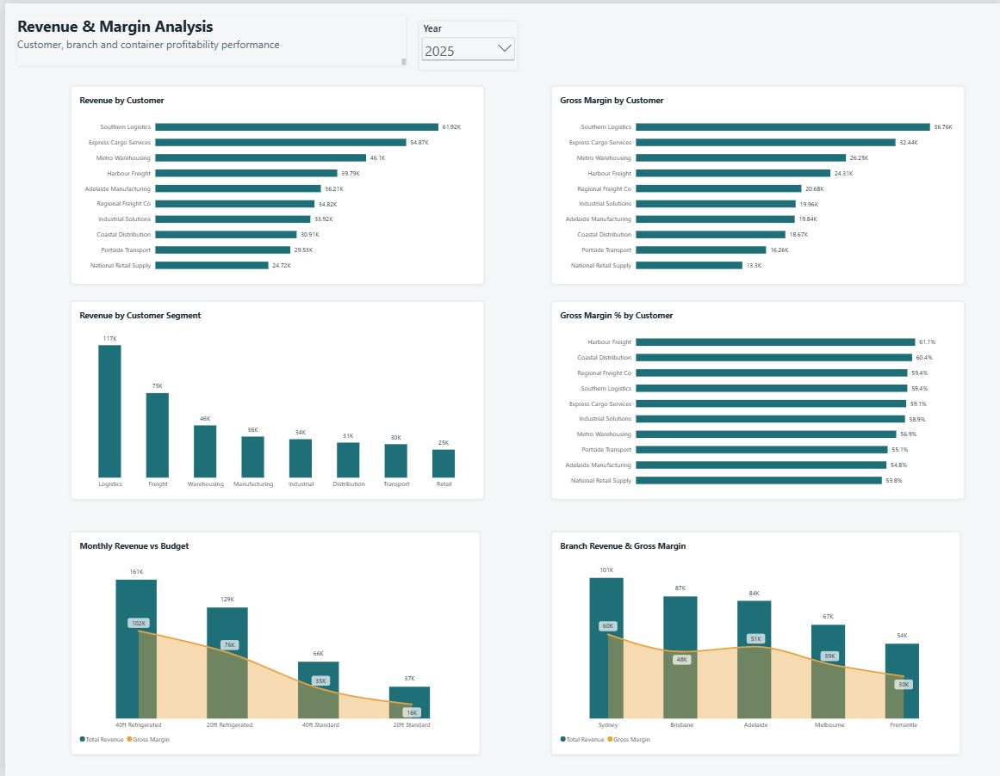
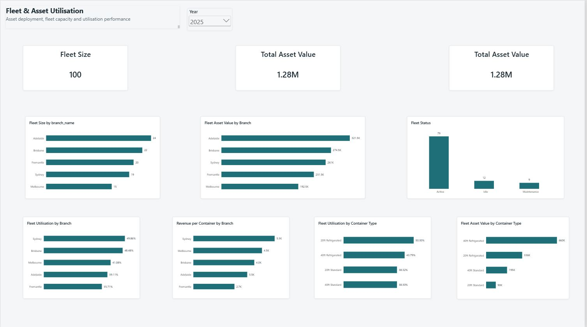
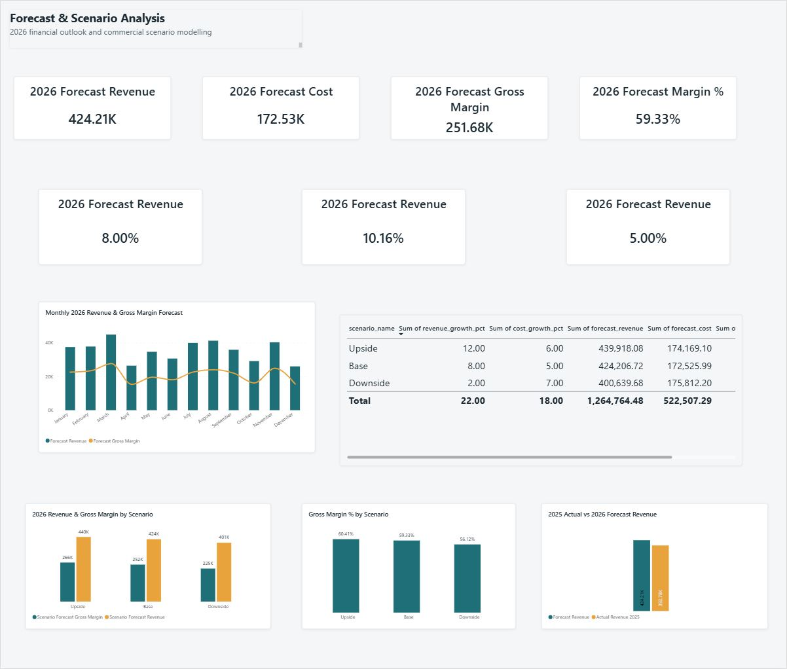

# Container-Fleet-Commercial-Finance-Analytics
Commercial finance analytics project using SQL, Power BI, Power Query and Excel

# Container Fleet Commercial Finance Analytics

## Project Overview

This project demonstrates an end-to-end commercial finance and data analytics solution for a container fleet business.

The solution combines operational fleet data, customer hire transactions, revenue and cost data, budgeting, forecasting, scenario modelling, and external Australian shipping data to provide management with a clear view of financial performance and asset utilisation.

The project was designed to simulate the analytical responsibilities of a Data & Reporting Analyst working with Commercial Finance, including:

- Revenue, cost and gross margin analysis
- Budget vs actual reporting
- Financial forecasting
- Downside, base and upside scenario modelling
- Fleet and asset utilisation analysis
- Customer, branch and container profitability analysis
- Data cleansing, validation and reconciliation
- SQL-based reporting views
- Power BI data modelling and DAX
- Integration of external Australian shipping market data

## Business Problem

A container fleet business needs to understand not only how much revenue it generates, but also whether its assets are being deployed efficiently and whether growth is translating into stronger profitability.

Management needs reliable reporting to answer questions such as:

- Are revenue and gross margin meeting budget?
- Which branches and customers generate the most value?
- Which container types deliver the strongest margins?
- Are fleet assets being utilised efficiently?
- How much revenue is generated per container?
- What is the expected financial performance for 2026?
- How would downside and upside assumptions affect profitability?
- How does the company's operating environment compare with broader Australian shipping activity?

This project builds a reporting solution designed to answer these questions and support commercial decision-making.

## Technology Stack

| Tool | Purpose |
|---|---|
| Python | Data extraction, cleaning, transformation and synthetic data generation |
| Pandas | Data manipulation and validation |
| SQL Server | Data storage, transformation and analytical queries |
| SQL Server Management Studio (SSMS) | Database development and testing |
| Power BI | Data modelling, DAX measures and interactive dashboards |
| Power Query | Data preparation and transformation |
| Excel | Source data review, reconciliation and commercial finance analysis |
| Git & GitHub | Version control and project documentation |

## Data Sources

This project combines real Australian Government shipping data with synthetic internal business data.

### External Market Data — Real Data

Australian shipping data was sourced from the Bureau of Infrastructure and Transport Research Economics (BITRE), Australian Infrastructure and Transport Statistics Yearbook.

The project uses:

- Container throughput by selected Australian ports, measured in TEU
- Maritime cargo loaded and discharged by Australian port
- Historical shipping activity across major Australian ports

This data provides external market context for the commercial analysis.

### Internal Business Data — Synthetic Data

The company-level commercial data used in this project is synthetic and was created specifically for portfolio and analytical purposes.

The synthetic dataset includes:

- Customers and customer segments
- Branches
- Container fleet and container types
- Asset values and fleet status
- Hire transactions
- Hire and transport revenue
- Transport and maintenance costs
- Gross margin
- Monthly budgets
- 2026 financial forecasts
- Downside, Base and Upside scenario assumptions

The synthetic data was designed with realistic business relationships and validation rules so that the project can demonstrate commercial finance analytics without using confidential company information.

## Data Architecture & Workflow

The project follows an end-to-end analytics workflow from raw data ingestion through to management reporting.

### Analytics Workflow

```text

BITRE Shipping Data + Synthetic Business Data
                    |
                    v
             Python / Pandas
        Cleaning & Transformation
                    |
                    v
             Processed CSV Files
                    |
                    v
              SQL Server
     Staging & Analytical Tables
                    |
                    v
            SQL Reporting Views
                    |
                    v
          Power Query / Power BI
                    |
                    v
       DAX Measures & Data Model
                    |
                    v
     Commercial Finance Dashboards

Container-Fleet-Commercial-Finance-Analytics/
│
├── data/
│   ├── raw/
│   └── processed/
│
├── notebooks/
│   └── 01_explore_shipping_data.ipynb
│
├── sql/
│   ├── 01_create_database_and_tables.sql
│   ├── 02_load_and_clean_data.sql
│   ├── 03_create_views.sql
│   └── 04_business_analysis_queries.sql
│
├── powerbi/
│   └── Container_Fleet_Commercial_Finance_Analytics.pbix
│
├── excel/
├── documentation/
├── images/
│   ├── executive_overview.png
│   ├── revenue_margin.png
│   ├── fleet_utilisation.png
│   └── forecast_scenarios.png
│
└── README.md

Container-Fleet-Commercial-Finance-Analytics/
│
├── data/
│   ├── raw/
│   └── processed/
│
├── notebooks/
│   └── 01_explore_shipping_data.ipynb
│
├── sql/
│   ├── 01_create_database_and_tables.sql
│   ├── 02_load_and_clean_data.sql
│   ├── 03_create_views.sql
│   └── 04_business_analysis_queries.sql
│
├── powerbi/
│   └── Container_Fleet_Commercial_Finance_Analytics.pbix
│
├── excel/
├── documentation/
├── images/
│   ├── executive_overview.png
│   ├── revenue_margin.png
│   ├── fleet_utilisation.png
│   └── forecast_scenarios.png
│
└── README.md

## Power BI Dashboard

The Power BI report was designed as a management reporting solution, moving from high-level commercial performance to detailed profitability, asset utilisation and forward-looking scenario analysis.

### 1. Executive Overview


![Executive Overview](images/executive_overview.png


The Executive Overview provides management with a consolidated view of commercial performance.

Key metrics include:

- Total Revenue
- Gross Margin
- Gross Margin %
- Total Hires
- Fleet Utilisation
- Revenue vs Budget %

The page also provides monthly revenue vs budget performance, revenue by branch, profitability by container type and the highest-value customers.

### 2. Revenue & Margin Analysis




This page provides deeper profitability analysis across customers, customer segments, branches and container types.

It enables management to identify:

- Highest-revenue customers
- Highest-margin customers
- Customer segment performance
- Revenue and gross margin by container type
- Revenue and gross margin by branch

### 3. Fleet & Asset Utilisation



This page focuses on asset productivity and fleet deployment.

Analysis includes:

- Fleet size
- Total asset value
- Fleet utilisation
- Fleet size and asset value by branch
- Revenue per container
- Utilisation by branch
- Utilisation by container type
- Fleet status

### 4. Forecast & Scenario Analysis



The forecast page provides a forward-looking view of commercial performance.

It includes:

- 2026 forecast revenue
- Forecast cost
- Forecast gross margin
- Forecast margin %
- Revenue, cost and gross margin growth
- Monthly revenue and gross margin forecast
- 2025 actual vs 2026 forecast revenue
- Downside, Base and Upside scenario modelling
- Scenario revenue, cost, gross margin and margin %

## Key Business Insights

### Financial Performance

- 2025 revenue reached **$392.8K**, generating **$228.5K gross margin** at a **58.17% gross margin rate**.
- Revenue increased by approximately **14.73% from 2024 to 2025**.
- Gross margin increased by approximately **15.28%**, slightly faster than revenue growth, indicating an improvement in profitability.

### Budget Performance

- 2025 annual revenue was **$392.8K** against a **$400.0K budget**, resulting in a **-$7.2K (-1.80%) variance**.
- Actual costs were approximately **$3.7K below budget**.
- Gross margin finished approximately **$3.5K (-1.52%) below budget**.
- Lower-than-budget costs partially offset the revenue shortfall.

### Fleet & Asset Utilisation

- Overall 2025 fleet utilisation was approximately **42.83%**, indicating available capacity for additional commercial activity.
- **Sydney achieved the highest branch utilisation at 49.86%**, despite operating fewer containers than Adelaide.
- Adelaide operated the largest fleet but recorded approximately **39.11% utilisation**, demonstrating that a larger asset base does not automatically produce stronger asset productivity.
- Sydney also generated the highest 2025 revenue per container at approximately **$5.3K**.
- Fremantle recorded both the lowest branch utilisation and the lowest revenue per container, highlighting a potential area for commercial review.

### Container Performance

- Refrigerated containers demonstrated stronger utilisation than standard container types.
- **20ft Refrigerated containers achieved the highest utilisation at approximately 50.30%.**
- Refrigerated container types also generated stronger gross margins than standard containers, suggesting that specialised fleet assets are important contributors to profitability.

### Forecast & Scenario Outlook

- The 2026 Base forecast projects revenue of approximately **$424.2K**, representing **8.00% growth** over 2025.
- Forecast costs increase by approximately **5.00%**, slower than revenue growth.
- Forecast gross margin reaches approximately **$251.7K**, representing **10.16% growth**.
- Forecast gross margin percentage improves to approximately **59.33%**.

Under the scenario analysis:

- **Downside:** $400.6K revenue, $224.8K gross margin and 56.12% margin.
- **Base:** $424.2K revenue, $251.7K gross margin and 59.33% margin.
- **Upside:** $439.9K revenue, $265.7K gross margin and 60.41% margin.

The scenario analysis demonstrates how different revenue and cost assumptions can materially affect profitability and provides management with a framework for forward-looking commercial planning.

## Data Quality & Validation

Data quality checks were performed throughout the pipeline to ensure that the reporting outputs were reliable and internally consistent.

Key validation activities included:

- Checking datasets for missing values and duplicate records.
- Validating data types before loading processed data into SQL Server.
- Standardising financial year and port fields in the external shipping datasets.
- Identifying and removing non-data footer and source rows imported from the BITRE workbook.
- Reconciling the cleaned container throughput dataset to the expected 160 records.
- Validating the maritime cargo dataset after transformation to ensure complete port, year and cargo-type combinations.
- Checking synthetic hire transactions for overlapping container hire periods.
- Correcting overlapping hire periods to prevent utilisation from being overstated.
- Clipping hire periods to the 2025 reporting window when calculating annual fleet utilisation.
- Reconciling SQL outputs against Power BI measures for revenue, cost, gross margin, budget variance and fleet utilisation.

### Validation Examples

The final 2025 fleet utilisation calculation produced:

- **15,633 hired days**
- **36,500 available fleet days**
- **42.83% fleet utilisation**

The 2025 financial results were also reconciled across SQL and Power BI:

- **Revenue:** $392,784
- **Total Cost:** $164,310.47
- **Gross Margin:** $228,473.53
- **Gross Margin %:** 58.17%

These checks help ensure that management reporting is based on consistent and validated analytical outputs.

## Skills Demonstrated

### Data Analytics & Engineering
- Python and Pandas for data cleaning, transformation and validation
- Excel data exploration and reconciliation
- ETL workflow development
- Data quality checking and validation
- Integration of external and internally generated datasets

### SQL
- Relational database design
- Dimension and fact table development
- Data cleansing and transformation
- SQL joins and aggregations
- Common Table Expressions (CTEs)
- Reporting views
- Business-focused analytical queries

### Power BI & DAX
- Data modelling and relationship management
- Power Query transformation
- DAX measure development
- Budget vs actual analysis
- Revenue and margin analysis
- Fleet utilisation analysis
- KPI reporting
- Forecasting and scenario analysis
- Interactive management dashboards

### Commercial Finance Analytics
- Revenue, cost and gross margin analysis
- Budget variance analysis
- Asset utilisation and productivity analysis
- Revenue per asset analysis
- Customer and branch profitability
- Forecast development
- Downside, Base and Upside scenario modelling
- Translation of analytical results into commercial insights

## Project Conclusion

This project demonstrates an end-to-end analytics solution that transforms raw operational, financial and external market data into decision-ready commercial reporting.

Rather than focusing only on historical reporting, the solution combines financial performance, budget variance, asset utilisation, forecasting and scenario modelling to support forward-looking commercial decisions.

The project demonstrates the ability to work across Python, SQL, Power BI and commercial finance concepts while maintaining a strong focus on data quality, validation and clear stakeholder reporting.